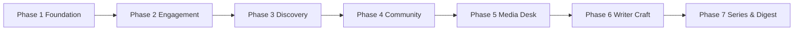

# Devnotes Planning

This file is the product and engineering plan for Devnotes. Use it before starting a phase, opening a large PR, or changing schema.

---

## North Star

Devnotes should feel like a quiet writing desk for developers: fast to read, honest to write, and social only where it helps the story.

Every feature must pass three checks:

1. **Story-first** — does this help someone publish or discover a better technical story?
2. **RLS-safe** — can a second logged-in user never see another author's drafts or private bookmarks?
3. **Zinc-quiet UI** — no noisy chrome, no extra color systems, no dashboard clutter.

---

## Completed Phases

| Phase | Theme | Shipped |
|---|---|---|
| **1** | Foundation | GitHub OAuth, write/publish, home feed, post pages, dashboard, profiles, base schema |
| **2** | Engagement | Settings, tags, likes, nested comments, richer post cards |
| **3** | Discovery & publishing | Search RPC, SEO metadata, sitemap, RSS, TTS reader, ISR revalidation |
| **4** | Community graph | Follows, Following feed, bookmarks, notifications, view counts, related posts, live comments |

---

## Active Phase Map



---

## Upcoming Phases

### Phase 5 — Media Desk
Turn URL-only images into first-class Supabase Storage uploads.

Unique delivery steps:

1. Create public buckets named `covers` and `avatars` only — no generic `uploads` bucket.
2. Cover files must be stored as `{author_id}/{post_id}-cover.*`.
3. Avatar files must be stored as `{user_id}/avatar.*` and overwrite in place.
4. Reject anything outside `image/jpeg`, `image/png`, `image/webp`.
5. The write page preview must show the uploaded cover before publish.
6. Settings must replace the avatar URL field with a one-click uploader, while still accepting GitHub's default avatar on first login.

### Phase 6 — Writer Craft
Make the editor feel like a notebook, not a textarea.

Unique delivery steps:

1. Split the `/write` workspace into **Draft | Preview** panes with a sticky word-count pill.
2. Autosave drafts every 20 seconds only when title + body both changed.
3. Add a `series_slug` optional field so multiple posts can share one series shelf.
4. Dashboard rows must show last autosave time for drafts.
5. Unpublished edits to a live story must not change `published_at`.

### Phase 7 — Series & Sunday Digest
Help readers follow a thread, not just a person.

Unique delivery steps:

1. Add a public `/series/[slug]` shelf that lists posts in author-defined order.
2. Related stories should prefer same-series posts before same-tag posts.
3. Build a `/digest.xml` feed that only includes posts published in the last 7 days.
4. Authors can toggle **Include in Sunday Digest** per story.
5. Notification type `digest_drop` is reserved and must not be reused for likes or comments.

---

## Out of Scope (for now)

- Multi-provider auth beyond GitHub
- Paid subscriptions / paywalled posts
- Admin moderation console
- Mobile native apps
- AI-generated post bodies

If a contribution needs one of these, open a planning discussion first. Do not sneak it into a phase PR.

---

## Schema Change Rule

Schema is append-only by phase block inside `supabase-schema.sql`.

```text
-- =============================================================================
-- PHASE N — short title
-- Safe to run on existing databases
-- =============================================================================
```

Never rewrite Phase 1–4 history unless a fresh-install bug makes the original `CREATE TABLE` unusable. Existing deployments run only the newest phase block.

---

## Branch & Release Plan

| Branch | Role |
|---|---|
| `dev` | Active implementation and review |
| `production` | Stable, merge-ready snapshot |

Phase work lands on `dev` as small PRs, then merges to `production` when the phase checklist in [CONTRIBUTING.md](./CONTRIBUTING.md) is green.

---

## Decision Log

| Date | Decision | Why |
|---|---|---|
| 2026-08 | GitHub OAuth only | Matches the developer audience and keeps auth simple |
| 2026-08 | Markdown, not a rich-text editor | Stories stay portable and diff-friendly |
| 2026-08 | Client-side likes/follows with optimistic UI | Instant feedback without server actions ceremony |
| 2026-08 | Notifications via DB triggers | Events stay consistent even if the client fails mid-request |
| 2026-08 | View counts via `increment_post_views` RPC | Anonymous readers can increment without gaining `UPDATE` on `posts` |
