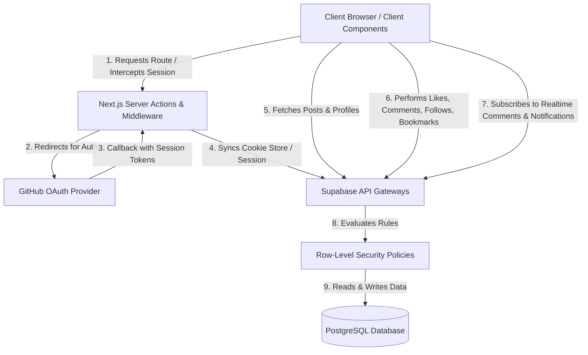

# Blogsite System Documentation

Welcome to the official system architecture and specification documentation for the **Devnotes** blog site. This document details the application's infrastructure layout, component interactions, database entities, security policies, and user flows.

Related docs:

- [PLANNING.md](./PLANNING.md) — phase roadmap and schema change rules
- [CONTRIBUTING.md](./CONTRIBUTING.md) — unique local desk-check and PR path

---

## 1. System Architecture

The application is architected around **Next.js App Router** (React Server Components and Client Components) integrated with **Supabase Backend-as-a-Service**.



### Server vs. Client Boundaries
- **Server Components**: Used for static/dynamic page generation (e.g., Homepage Feed, Single Post page, Tag archive views). They query Supabase directly on the server to optimize loading times, render content, and reduce client-side Javascript.
- **Client Components**: Used where interactivity is key (e.g., the write editor page, the like toggle button, follow/bookmark controls, notification bell, settings profile fields, and comment submission forms).
- **Session Middleware**: Intercepts `/dashboard`, `/write`, `/settings`, `/bookmarks`, and `/notifications` to verify authentication status and redirect unauthorized requests to `/login`.

---

## 2. Directory Structure

```text
blog-app/
├── app/
│   ├── [username]/
│   │   └── page.tsx             # Public Profile Page (Lists user's published posts)
│   ├── auth/
│   │   └── callback/
│   │       └── route.ts         # OAuth callback route to establish token sessions
│   ├── login/
│   │   └── page.tsx             # GitHub Authentication portal
│   ├── dashboard/
│   │   └── page.tsx             # Author dashboard for editing drafts or new posts
│   ├── bookmarks/
│   │   └── page.tsx             # Private reading list
│   ├── notifications/
│   │   └── page.tsx             # In-app notification inbox
│   ├── posts/
│   │   └── [slug]/
│   │       └── page.tsx         # Article details page with Likes & Comments section
│   ├── settings/
│   │   └── page.tsx             # Profile settings editor (Bio, username, avatar)
│   ├── tags/
│   │   └── [slug]/
│   │       └── page.tsx         # Tag listing route (Shows all posts under a tag)
│   ├── write/
│   │   └── page.tsx             # Editor workspace (Supports saving drafts/publishing)
│   ├── layout.tsx               # Root layout shell with site header
│   ├── globals.css              # Styling rules (Tailwind utilities and custom fonts)
│   └── middleware.ts            # Auth protection router guard
├── components/
│   ├── Navbar.tsx               # Header toolbar (displays avatar/links based on session)
│   ├── PostCard.tsx             # Card element displaying post meta, reading time, and tags
│   ├── CommentSection.tsx       # Live threaded discussion element
│   ├── LikeButton.tsx           # Optimistic reactions toggle button
│   ├── BookmarkButton.tsx       # Reading list toggle
│   ├── FollowButton.tsx         # Author follow control
│   ├── NotificationBell.tsx     # Realtime notification dropdown
│   ├── TagInput.tsx             # Comma/Enter separated tagging control
│   └── ImageUploader.tsx        # Cover/avatar file picker with local preview (Phase 5)
├── lib/
│   ├── supabaseClient.ts        # Client-side Supabase client instance builder
│   ├── supabaseServer.ts        # Server-side Supabase client instance builder
│   └── storage.ts               # Cover/avatar path + MIME helpers for Storage (Phase 5)
├── supabase-schema.sql          # Full database definition SQL
└── tailwind.config.ts           # Design tokens configuration
```

---

## 3. Database Schema & Policies Reference

All records are stored in PostgreSQL on Supabase. RLS policies control table operations.

### Tables

| Table | Column | Type | Attributes | Description |
|---|---|---|---|---|
| **profiles** | `id` | `uuid` | Primary Key, FK -> auth.users | Holds display metadata for registered authors. |
| | `username` | `text` | Unique, Not Null | Unique public namespace (e.g., `@developer`). |
| | `avatar_url` | `text` | Nullable | Remote URL pointing to profile image. |
| | `bio` | `text` | Nullable (Max 200 chars) | Creator biography text. |
| | `created_at` | `timestamptz`| Default `now()` | Registration timestamp. |
| **posts** | `id` | `uuid` | Primary Key, Default Gen UUID| Internal identifier. |
| | `author_id` | `uuid` | FK -> profiles.id | Post owner / editor. |
| | `title` | `text` | Not Null | Post heading text. |
| | `slug` | `text` | Unique, Not Null | URL pathway identifier. |
| | `content_md`| `text` | Not Null | Markdown body content. |
| | `cover_image`| `text` | Nullable | URL pointing to cover graphic. |
| | `status` | `text` | Check ('draft', 'published')| Lifecycle status. |
| | `published_at`| `timestamptz`| Nullable | Date post was changed from Draft to Published. |
| | `view_count` | `integer` | Default `0` | Public view counter incremented via RPC. |
| | `created_at`| `timestamptz`| Default `now()` | Creation date. |
| **tags** | `id` | `uuid` | Primary Key | Internal identifier. |
| | `name` | `text` | Unique, Not Null | Text name (e.g., 'nextjs'). |
| | `slug` | `text` | Unique, Not Null | URL safe version of tag name. |
| **post_tags** | `post_id` | `uuid` | Primary Key, FK -> posts.id | Map association. |
| | `tag_id` | `uuid` | Primary Key, FK -> tags.id | Map association. |
| **comments** | `id` | `uuid` | Primary Key | Comment identifier. |
| | `post_id` | `uuid` | FK -> posts.id | Linked article post. |
| | `author_id` | `uuid` | FK -> profiles.id | Author of the comment. |
| | `parent_id` | `uuid` | Nullable, FK -> comments.id | Thread parent id for nesting. |
| | `content` | `text` | Not Null | Plain text comment value. |
| | `created_at`| `timestamptz`| Default `now()` | Creation date. |
| **reactions** | `post_id` | `uuid` | Primary Key, FK -> posts.id | Linked article post. |
| | `user_id` | `uuid` | Primary Key, FK -> profiles.id | Author liking the post. |
| | `type` | `text` | Default 'like' | Type of reaction registered. |
| **follows** | `follower_id` | `uuid` | PK, FK -> profiles.id | User who follows. |
| | `following_id` | `uuid` | PK, FK -> profiles.id | User being followed. |
| **bookmarks** | `user_id` | `uuid` | PK, FK -> profiles.id | Owner of the reading list item. |
| | `post_id` | `uuid` | PK, FK -> posts.id | Saved story. |
| **notifications** | `id` | `uuid` | Primary Key | Notification identifier. |
| | `user_id` | `uuid` | FK -> profiles.id | Recipient. |
| | `actor_id` | `uuid` | FK -> profiles.id | User who triggered the event. |
| | `type` | `text` | like / comment / reply / follow | Event category. |
| | `read` | `boolean` | Default false | Inbox read state. |

### Row Level Security (RLS) Policies
- **`posts`**:
  - `SELECT`: Anyone can select where `status = 'published'`, but drafts can only be selected where `auth.uid() = author_id`.
  - `INSERT` / `UPDATE` / `DELETE`: Allowed only if the authenticated user's ID matches the post's `author_id`.
- **`profiles`**:
  - `SELECT`: Everyone can read profiles.
  - `UPDATE`: Allowed only if the user's ID matches the profile `id`.
- **`comments`**:
  - `SELECT`: Everyone can read comments.
  - `INSERT`: Allowed for authenticated users where `auth.uid() = author_id`.
  - `DELETE`: Allowed if user is the comment owner.
- **`reactions`**:
  - `SELECT`: Publicly readable.
  - `INSERT` / `DELETE`: Restricted to the authenticated user matching `user_id`.
- **`follows`**:
  - `SELECT`: Publicly readable.
  - `INSERT` / `DELETE`: Restricted to the authenticated follower.
- **`bookmarks`**:
  - `SELECT` / `INSERT` / `DELETE`: Restricted to the authenticated bookmark owner.
- **`notifications`**:
  - `SELECT` / `UPDATE` / `DELETE`: Restricted to the recipient. Inserts are created by security-definer triggers.

### Storage (Supabase Storage) — Phase 5 Media Desk

Two **public** buckets exist: `covers` and `avatars`. There is no generic `uploads` bucket.

| Bucket | Object path | Rule |
|---|---|---|
| `covers` | `{author_id}/{post_id}-cover.{jpg\|png\|webp}` | Cover art for a post. |
| `avatars` | `{user_id}/avatar.{jpg\|png\|webp}` | Fixed path; re-upload overwrites in place. |

- **SSE RLS** on `storage.objects`:
  - Anyone may `SELECT` from either bucket.
  - `INSERT` / `UPDATE` / `DELETE` are restricted to the authenticated user whose ID equals `path_tokens[1]` (the folder owner). UPDATE uses both `USING` and `WITH CHECK` to prevent path-poisoning by rename.
- **Shape + MIME guards** (`check_cover_upload`, `check_avatar_upload` triggers) reject anything outside the path shape above and any MIME other than `image/jpeg`, `image/png`, `image/webp`.

---

## 4. Operational User Flows

### Writing & Tagging Flow
1. The user logs in via GitHub and navigates to `/write`.
2. As they enter text, they type tag terms into the **Tags Input**. Commas and Enter convert inputs into tags (e.g. `javascript`).
3. The user can optionally pick a **cover image** with the `ImageUploader`, which shows a local preview before publish. The file is uploaded to the `covers` bucket only after the post row exists, stored as `{author_id}/{post_id}-cover.{ext}`, and its public URL is written to `cover_image`.
4. On save/publish:
   - The post is created/updated.
   - Tags are bulk upserted into the `tags` database table on-conflict of unique name.
   - The post's current connections inside `post_tags` are deleted, and the new set is batch inserted.

### Engagement (Likes & Comments) Flow
1. An article page `/posts/[slug]` is requested.
2. The page component fetches:
   - Post content, author, and associated tag links.
   - Total count of reactions matching `post_id`.
   - Active status check: does `reactions` contain a match for `(post_id, current_user_id)`?
3. If the user clicks **Like**:
   - The state optimistically toggles visually and increments/decrements the total counter.
   - A database API request updates `reactions` in the background. If it fails, the count rolls back.
4. Under the comments form, users can type a comment or click **Reply** to type a nested comment response. Deleting a comment removes it (along with its children due to database cascade rules).

### Settings Configuration Flow
1. Navigating to `/settings` opens user info fields.
2. The profile photo field is a one-click `ImageUploader`: choosing a file uploads it to the `avatars` bucket at `{user_id}/avatar.{ext}` (overwriting in place) and stores the public URL. GitHub's default avatar is still accepted on first login.
3. Saving validates the username handle (removing spaces and invalid characters).
4. On successful updates, changes update profiles and propagate across all post card elements.

### Follow, Bookmark & Notification Flow
1. Readers can follow an author from `/@username`. The homepage **Following** tab then shows only stories from followed writers.
2. The **Save** control on an article writes a private `bookmarks` row and surfaces the story on `/bookmarks`.
3. Likes, comments, replies, and follows insert `notifications` rows through database triggers.
4. The navbar bell subscribes to Realtime inserts and deep-links into the related story or profile. Opening `/notifications` marks unread items as read.
5. Article views call `increment_post_views(post_id)` once per browser session.

---

## 5. Design & Styling System

The project uses **Tailwind CSS** following a content-focused modern aesthetic:
- **Palette**: Clean slate/zinc grays (`bg-zinc-50`, `text-zinc-900`) for the canvas. Primary controls styled with black/zinc-950 and white text.
- **Typography**: Inter (sans-serif) for article headers, margins, and layout controls. Mono fonts for editor input areas.
- **Components**: Rounded corners (`rounded-xl` / `rounded-2xl`) and subtle border strokes (`border-zinc-150`) to frame cards without visual clutter.
- **Feedback**: Optimistic animations and smooth scale transitions (`hover:shadow-md transition-all duration-200`) enhance responsiveness.
