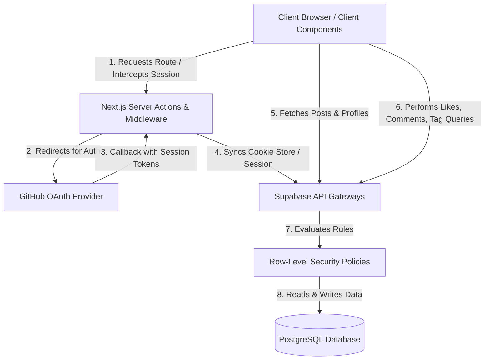

# Blogsite System Documentation

Welcome to the official system architecture and specification documentation for the **Devnotes** blog site. This document details the application's infrastructure layout, component interactions, database entities, security policies, and user flows.

---

## 1. System Architecture

The application is architected around **Next.js App Router** (React Server Components and Client Components) integrated with **Supabase Backend-as-a-Service**.



### Server vs. Client Boundaries
- **Server Components**: Used for static/dynamic page generation (e.g., Homepage Feed, Single Post page, Tag archive views). They query Supabase directly on the server to optimize loading times, render content, and reduce client-side Javascript.
- **Client Components**: Used where interactivity is key (e.g., the write editor page, the like toggle button, settings profile fields, and comment submission forms).
- **Session Middleware**: Intercepts `/dashboard`, `/write`, and `/settings` to verify authentication status and redirect unauthorized requests to `/login`.

---

## 2. Directory Structure

```text
blog-app/
├── app/
│   ├── [username]/
│   │   └── page.tsx             # Public Profile Page (Lists user's published posts)
│   ├── auth/
│   │   └── callback/
│   │       └── route.ts         # OAuth callback route to establish token sessions
│   ├── login/
│   │   └── page.tsx             # GitHub Authentication portal
│   ├── dashboard/
│   │   └── page.tsx             # Author dashboard for editing drafts or new posts
│   ├── posts/
│   │   └── [slug]/
│   │       └── page.tsx         # Article details page with Likes & Comments section
│   ├── settings/
│   │   └── page.tsx             # Profile settings editor (Bio, username, avatar)
│   ├── tags/
│   │   └── [slug]/
│   │       └── page.tsx         # Tag listing route (Shows all posts under a tag)
│   ├── write/
│   │   └── page.tsx             # Editor workspace (Supports saving drafts/publishing)
│   ├── layout.tsx               # Root layout shell with site header
│   ├── globals.css              # Styling rules (Tailwind utilities and custom fonts)
│   └── middleware.ts            # Auth protection router guard
├── components/
│   ├── Navbar.tsx               # Header toolbar (displays avatar/links based on session)
│   ├── PostCard.tsx             # Card element displaying post meta, reading time, and tags
│   ├── CommentSection.tsx       # Live threaded discussion element
│   ├── LikeButton.tsx           # Optimistic reactions toggle button
│   └── TagInput.tsx             # Comma/Enter separated tagging control
├── lib/
│   ├── supabaseClient.ts        # Client-side Supabase client instance builder
│   └── supabaseServer.ts        # Server-side Supabase client instance builder
├── supabase-schema.sql          # Full database definition SQL
└── tailwind.config.ts           # Design tokens configuration
```

---

## 3. Database Schema & Policies Reference

All records are stored in PostgreSQL on Supabase. RLS policies control table operations.

### Tables

| Table | Column | Type | Attributes | Description |
|---|---|---|---|---|
| **profiles** | `id` | `uuid` | Primary Key, FK -> auth.users | Holds display metadata for registered authors. |
| | `username` | `text` | Unique, Not Null | Unique public namespace (e.g., `@developer`). |
| | `avatar_url` | `text` | Nullable | Remote URL pointing to profile image. |
| | `bio` | `text` | Nullable (Max 200 chars) | Creator biography text. |
| | `created_at` | `timestamptz`| Default `now()` | Registration timestamp. |
| **posts** | `id` | `uuid` | Primary Key, Default Gen UUID| Internal identifier. |
| | `author_id` | `uuid` | FK -> profiles.id | Post owner / editor. |
| | `title` | `text` | Not Null | Post heading text. |
| | `slug` | `text` | Unique, Not Null | URL pathway identifier. |
| | `content_md`| `text` | Not Null | Markdown body content. |
| | `cover_image`| `text` | Nullable | URL pointing to cover graphic. |
| | `status` | `text` | Check ('draft', 'published')| Lifecycle status. |
| | `published_at`| `timestamptz`| Nullable | Date post was changed from Draft to Published. |
| | `created_at`| `timestamptz`| Default `now()` | Creation date. |
| **tags** | `id` | `uuid` | Primary Key | Internal identifier. |
| | `name` | `text` | Unique, Not Null | Text name (e.g., 'nextjs'). |
| | `slug` | `text` | Unique, Not Null | URL safe version of tag name. |
| **post_tags** | `post_id` | `uuid` | Primary Key, FK -> posts.id | Map association. |
| | `tag_id` | `uuid` | Primary Key, FK -> tags.id | Map association. |
| **comments** | `id` | `uuid` | Primary Key | Comment identifier. |
| | `post_id` | `uuid` | FK -> posts.id | Linked article post. |
| | `author_id` | `uuid` | FK -> profiles.id | Author of the comment. |
| | `parent_id` | `uuid` | Nullable, FK -> comments.id | Thread parent id for nesting. |
| | `content` | `text` | Not Null | Plain text comment value. |
| | `created_at`| `timestamptz`| Default `now()` | Creation date. |
| **reactions** | `post_id` | `uuid` | Primary Key, FK -> posts.id | Linked article post. |
| | `user_id` | `uuid` | Primary Key, FK -> profiles.id | Author liking the post. |
| | `type` | `text` | Default 'like' | Type of reaction registered. |

### Row Level Security (RLS) Policies
- **`posts`**:
  - `SELECT`: Anyone can select where `status = 'published'`, but drafts can only be selected where `auth.uid() = author_id`.
  - `INSERT` / `UPDATE` / `DELETE`: Allowed only if the authenticated user's ID matches the post's `author_id`.
- **`profiles`**:
  - `SELECT`: Everyone can read profiles.
  - `UPDATE`: Allowed only if the user's ID matches the profile `id`.
- **`comments`**:
  - `SELECT`: Everyone can read comments.
  - `INSERT`: Allowed for authenticated users where `auth.uid() = author_id`.
  - `DELETE`: Allowed if user is the comment owner.
- **`reactions`**:
  - `SELECT`: Publicly readable.
  - `INSERT` / `DELETE`: Restricted to the authenticated user matching `user_id`.

---

## 4. Operational User Flows

### Writing & Tagging Flow
1. The user logs in via GitHub and navigates to `/write`.
2. As they enter text, they type tag terms into the **Tags Input**. Commas and Enter convert inputs into tags (e.g. `javascript`).
3. On save/publish:
   - The post is created/updated.
   - Tags are bulk upserted into the `tags` database table on-conflict of unique name.
   - The post's current connections inside `post_tags` are deleted, and the new set is batch inserted.

### Engagement (Likes & Comments) Flow
1. An article page `/posts/[slug]` is requested.
2. The page component fetches:
   - Post content, author, and associated tag links.
   - Total count of reactions matching `post_id`.
   - Active status check: does `reactions` contain a match for `(post_id, current_user_id)`?
3. If the user clicks **Like**:
   - The state optimistically toggles visually and increments/decrements the total counter.
   - A database API request updates `reactions` in the background. If it fails, the count rolls back.
4. Under the comments form, users can type a comment or click **Reply** to type a nested comment response. Deleting a comment removes it (along with its children due to database cascade rules).

### Settings Configuration Flow
1. Navigating to `/settings` opens user info fields.
2. Saving validates the username handle (removing spaces and invalid characters).
3. On successful updates, changes update profiles and propagate across all post card elements.

---

## 5. Design & Styling System

The project uses **Tailwind CSS** following a content-focused modern aesthetic:
- **Palette**: Clean slate/zinc grays (`bg-zinc-50`, `text-zinc-900`) for the canvas. Primary controls styled with black/zinc-950 and white text.
- **Typography**: Inter (sans-serif) for article headers, margins, and layout controls. Mono fonts for editor input areas.
- **Components**: Rounded corners (`rounded-xl` / `rounded-2xl`) and subtle border strokes (`border-zinc-150`) to frame cards without visual clutter.
- **Feedback**: Optimistic animations and smooth scale transitions (`hover:shadow-md transition-all duration-200`) enhance responsiveness.
