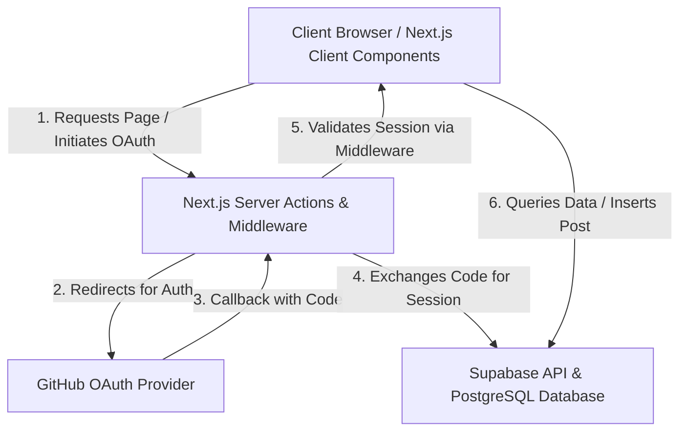

# Blogsite System Documentation

Welcome to the official documentation for the **Blogsite** application. This document details the system architecture, directory layouts, database schemas, styling conventions, and user flows.

---

## 1. System Architecture

The application is built using the **Next.js App Router** framework and **Supabase** for Backend-as-a-Service (Auth, Database, Storage, and Realtime).



---

## 2. Directory Structure

This structure highlights the full path layout of the project, including the configuration files required for Tailwind CSS, TypeScript, and ESLint.

```
blog-app/
├── app/
│   ├── auth/
│   │   └── callback/
│   │       └── route.ts             # OAuth Callback Route Handler
│   ├── login/
│   │   └── page.tsx                 # Login UI & OAuth Initiator
│   ├── dashboard/
│   │   └── page.tsx                 # Author Dashboard (Drafts / Published Posts)
│   ├── posts/
│   │   └── [slug]/
│   │       └── page.tsx             # Public single-post page (with markdown rendering)
│   ├── write/
│   │   └── page.tsx                 # Create & Edit Post Markdown Editor
│   ├── layout.tsx                   # Root Layout with Global Navbar & Header
│   ├── page.tsx                     # Public Homepage (Feeds list of published posts)
│   ├── globals.css                  # Tailwind and global styles
│   └── middleware.ts                # Auth guard and session refreshing middleware
├── components/
│   ├── Navbar.tsx                   # Dynamic site header showing user avatar/login states
│   └── PostCard.tsx                 # Post preview element inside homepage feeds
├── lib/
│   ├── supabaseClient.ts            # Client-side Supabase client factory
│   └── supabaseServer.ts            # Server-side Supabase client factory
├── supabase-schema.sql              # Database DDL statements & security policies
├── tailwind.config.ts               # Custom Tailwind utilities & color design tokens
├── package.json                     # Project scripts and dependencies
└── tsconfig.json                    # TypeScript compiler configuration
```

---

## 3. Database Schema Reference

The PostgreSQL database runs on Supabase. Below is a detailed view of the entity relationships:

| Table | Column | Type | Attributes | Description |
|---|---|---|---|---|
| **profiles** | `id` | `uuid` | Primary Key, FK -> auth.users | Public user profile information |
| | `username` | `text` | Unique, Not Null | Public display name / handle |
| | `avatar_url` | `text` | Nullable | URL to user's profile image |
| | `bio` | `text` | Nullable | Short biography |
| | `created_at` | `timestamptz`| Default `now()` | Registration date |
| **posts** | `id` | `uuid` | Primary Key, Default UUID | Unique post ID |
| | `author_id` | `uuid` | FK -> profiles.id, Not Null | Author profile link |
| | `title` | `text` | Not Null | Title of the post |
| | `slug` | `text` | Unique, Not Null | URL slug path identifier |
| | `content_md`| `text` | Not Null | Markdown content of the post |
| | `cover_image`| `text` | Nullable | URL to cover image asset |
| | `status` | `text` | Check ('draft', 'published') | Post lifecycle status |
| | `published_at`| `timestamptz`| Nullable | Date post was made public |
| | `created_at`| `timestamptz`| Default `now()` | Date post draft was initiated |

---

## 4. User Flows

### Writing & Publishing Flow
1. User logs in using GitHub OAuth.
2. User clicks the **"Write a post"** button in the header.
3. Middleware intercepts `/write` and verifies the active session.
4. User writes content in the Markdown Editor.
5. User selects **"Save Draft"** or **"Publish"**:
   - Saving as **Draft** inserts the post with `status = 'draft'`. It appears only in the user's private dashboard.
   - Choosing **Publish** sets `status = 'published'`, generates a timestamp in `published_at`, and redirects the user to the public article URL (`/posts/[slug]`).

---

## 5. Design & Styling System

The application utilizes **Tailwind CSS** with a minimalist, content-focused dark/light color palette (using Slate/Zinc colors) and subtle glassmorphic elements:

- **Typography**: Inter (sans-serif) for body content, system font stack for the Markdown code editor.
- **Form controls**: Focus states using sharp outlines (`ring-2 ring-zinc-950`).
- **Cards**: Minimal thin borders (`border border-zinc-100`) with smooth scaling on hover (`hover:shadow-md transition`).
- **Interactive States**: Smooth transition duration controls (`transition-all duration-200 ease-in-out`).
